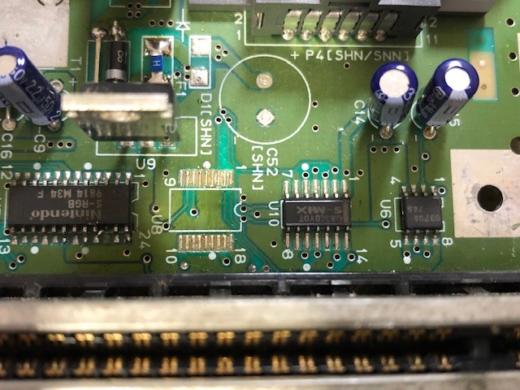
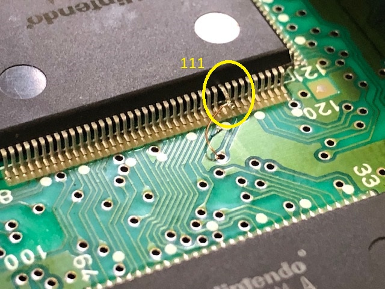
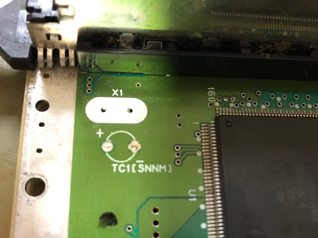
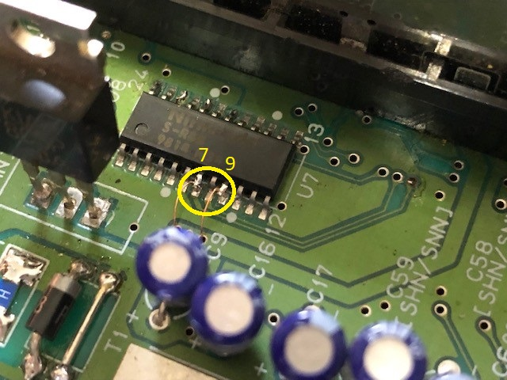
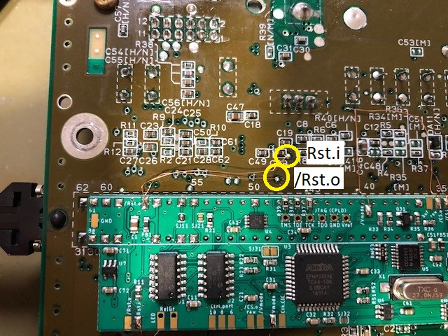
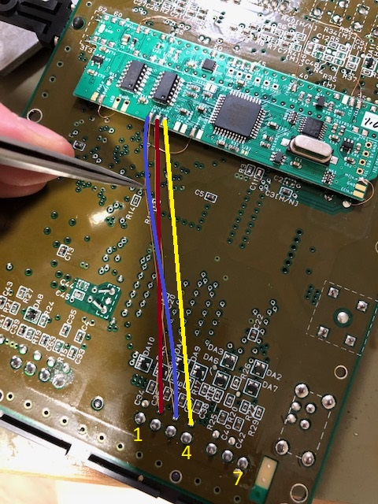
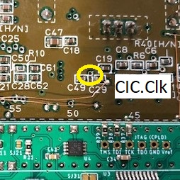
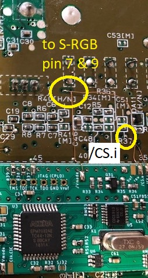

## SNN-CPU-01

### Preparation

- remove original CIC-lock (or at least lift pins 1, 2, 10 and 11), which sits behind the cartridge port between S-RGB and S-MIX  
  
  - if you remove the CIC-lock, you can also remove C9  
  - **Please note that the picture shows the US version and not the Jap. version of the console.** The US version does not have the large 1000uF capacitor C52 installed - the picture might be confusing. **Do not remove C52 if you have a Jap. console!**

- lift pin 111 of S-CPUN  
  

- remove X1  
  

- lift pin 7 and pin 9 of S-RGB  
  

### Installation of PCB

- Solder PCB in place under the cartridge slot. Be aware of the orientation (pin marking must match)
  
  - If you have large brightness correcting resistors installed, you may have to reinstall / reroute due to possible fitting collisions. I personally removed them (it's not mine SNES2) and replaced [R3](https://github.com/borti4938/SNES-AddOn-PCBs/tree/master/RGB%20Bypass#brightness-and-ghosting-issues) instead
  - solder the PCB to the top of the slot pins such that there is a small between SNES mainboard and modding board  
    (which is easy to do if you ordered the PCB in 0.8mm thickness)  
    (or simply insulate the PCB with some tape at the bottom)
  - make sure that all connections are well flowed
  - especially pin 5 and 36 might be difficult or need more power due to large heat capacity of the underlying GND plane
- connect _Rst.i_  to CIC-lock footprint pin 8; connect _/Rst.o_ (either pad) to CIC-lock footprint pin 10. There are two vias directly above the cartridge slot, which you can use  
    
- connect _Ctrl.port.10, 8_ and _6_ to controller one connector pin 3, 2 and 4 respectively  
     
  Note that the term _Ctrl.port_ on the silkscreen corresponds to the panel connector of the big model SNES 
- connect _Vmode_ to lifted pin 111 of the S-CPUN  
  Be aware of the housing if you route the wire around the housing
- either close _SJ11_ or connect _Clk.CIC_ to the via between C49 and C29  
  
- connect _MCLK.o_ to X1 (the side, which goes to S-CPUN pin 9)  
  
- connect _/CS.i_ to the pad of the lifted pin 7 of the S-RGB; connect one of the _/CS.o (raw)_ pads to the lifted pin 7 of the S-RGB  
  
- connect one of the _/Vmode_ pad to the lifted pin 9 of the S-RGB
- Connect _/CS.o (buf)_ to pin 3 of the MultiOut
- leave _SJ32_ and _SJ61_  open!

### Color Carrier

Color carrier is switched within the S-CPUN. There is no need to do anything in addition to the steps above.

### CSYNC and 'my' RGB bypass PCB

I do have an RGB bypass PCB in this repository. Just take a [look](../../../RGB Bypass/). If you use a version with CSYNC you can connect _/CS.o (raw)_ to this PCB to use it. However, you have to adopt some resistor values:

- R41: 4.7kohm
- R42:
  - 475ohm for 39ohm/75ohm compatible setup
  - 10.7kohm for TTL compatible setup

Please also take a look into the [readme](../../../RGB Bypass/README.md) and the [BOM](../../../RGB Bypass/BOM_SNES_RGB_bypass.xlsx) of that project.

### Have fun!!!