## SNS-CPU-01

### Preparation

- remove power LED
- remove original CIC-lock (or at least lift pins 1, 2, 10 and 11)  
  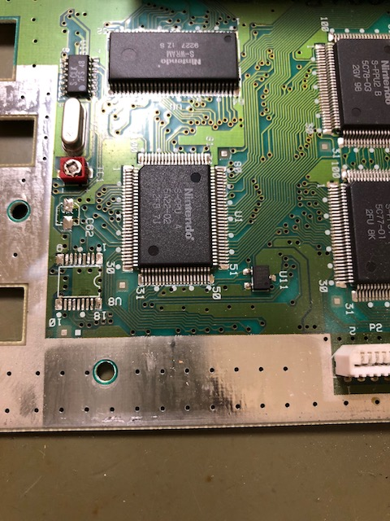
  
- if you remove the CIC-lock, you can also remove C62
  
- lift pin 24 of S-PPU1 and pin 30 of S-PPU2  
  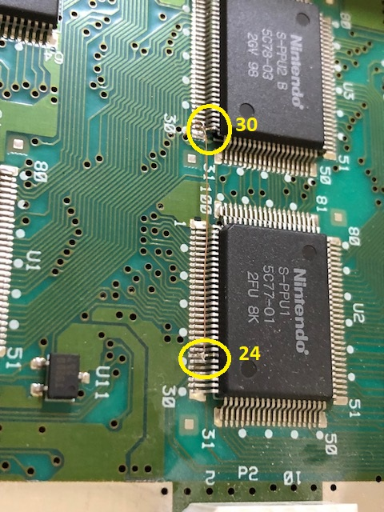

- disconnect Master-Clock by remove R73, which is just a jumper  
  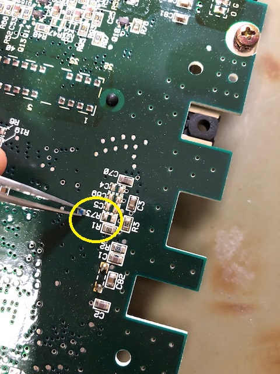

  (I soldered one leg of the resistor back to a footprint side to save it for possible mod-reverse)

- lift pin 8 of S-ENC   
  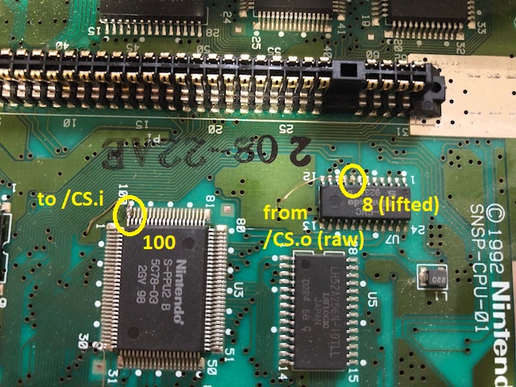

### Installation of PCB

- Solder PCB in place under the cartridge slot. Be aware of the orientation (pin marking must match)
  - solder the PCB to the top of the slot pins such that there is a small between SNES mainboard and modding board  
    (which is easy to do if you ordered the PCB in 0.8mm thickness)  
    (or simply insulate the PCB with some tape at the bottom)
  - make sure that all connections are well flowed
  - especially pin 5 and 36 might be difficult or need more power due to large heat capacity of the underlying GND plane
- put the replacement dual LED where the original was (use a small piece of hot glue if needed) and connect the common pole to either _Ground_ or _Vcc_ (common cathod or anode, respectively)  
  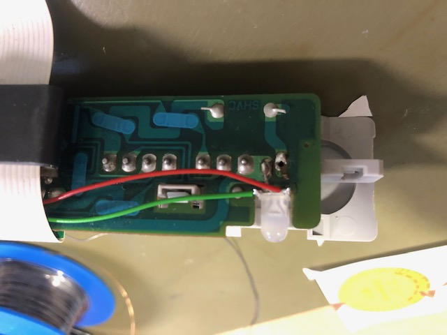  
  (Picture shows a bi-color LED with common cathode and cables for red and green attached)
  - it's a good idea to connect red and green to _LED.Re_ and _LED.Gr_ once everything is finished
  - be aware of the SNES housing (if you still use the original one of this SNES mainboard), where a stability bridge is placed at the SNES mainboard front with just a cut out under the front panel connector
- connect _Rst.i_ and _Rst.o_ (either pad) to CIC-lock footprint pin 8 and 10, respectively  
  on this mainboard version, it's a good idea to connect _Rst.i_ and _Rst.o_ to the reset button and a test-point as shown
- connect _Ctrl.port.10-6_ to front panel connector pins 10 - 6
- connect _Vmode_ to lifted pins 24 and 30 of the S-PPUs
- connect _/CS.i_ to pin 100 of S-PPU2 (see picture above)
- connect one of the _/CS.o (raw)_ pads to the lifted pin 8 of the S-ENC (see picture above)
- either close _SJ11_ or connect _Clk.CIC_ to CIC-lock footprint pin 7 or right pad of C4 as shown  
  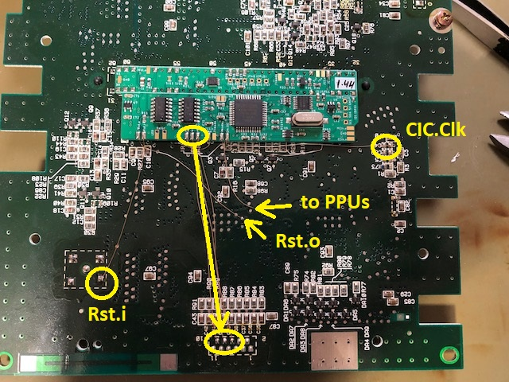
- close _SJ32_ and _SJ61_  
  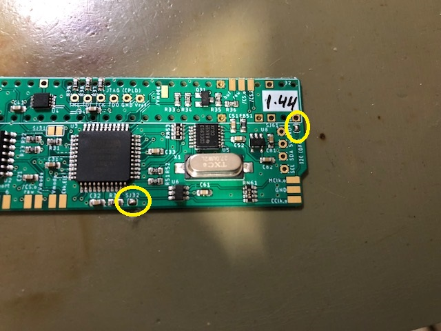

### CSYNC at the MultiOut

Personally, I prefer having csync at pin 7 of the MultiOut. By default, this is the luma-output. However, S-Video is hardly used in PAL region.

- remove R25 from the SNES mainboard  
  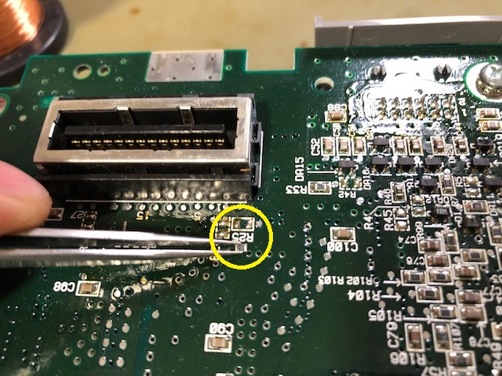
- Connect _/CS.o (buf)_ to the MultiOut pin 7  
  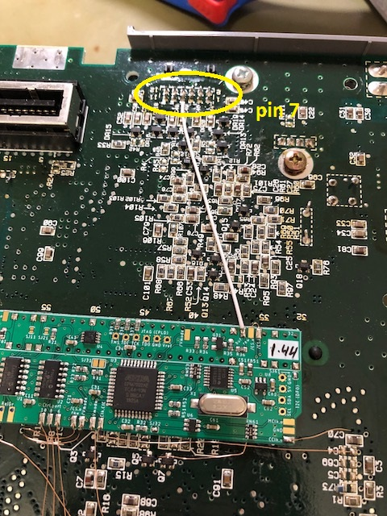

### Switching Color Carrier

With the help of the modding PCB you can switch between PAL and NTSC color carrier. 

- lift pin 19 of the S-ENC
- connect either  _/Vmode_ pad to the lifted pin as shown  
  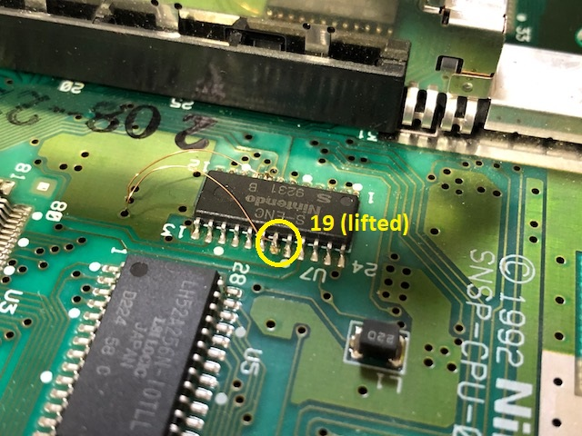
- lift pin 5 of the S-CLK
- connect the _CClk.o_ pad to the pad of the lifted pin  
  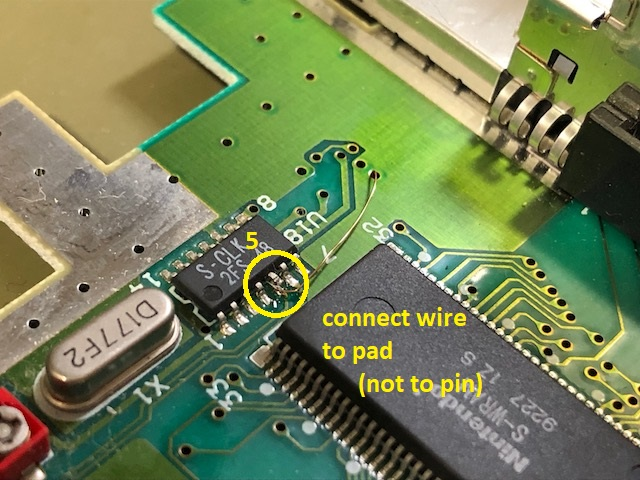

### Use of NTSC Game Pads

Earlier PAL models were equipped with special game pad connector panels, which does not allow the user to use NTSC game pads. There are four diodes placed inside the traces of pad 1 and 2, which need PAL game pads to have two additional resistors inside. However, there is an easy fix to make it universal for all game pads. 

- Just short all diodes on the panel  
  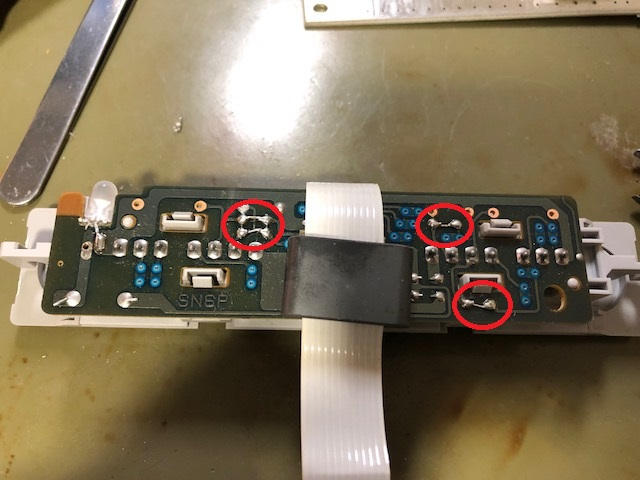

### Have fun!!!